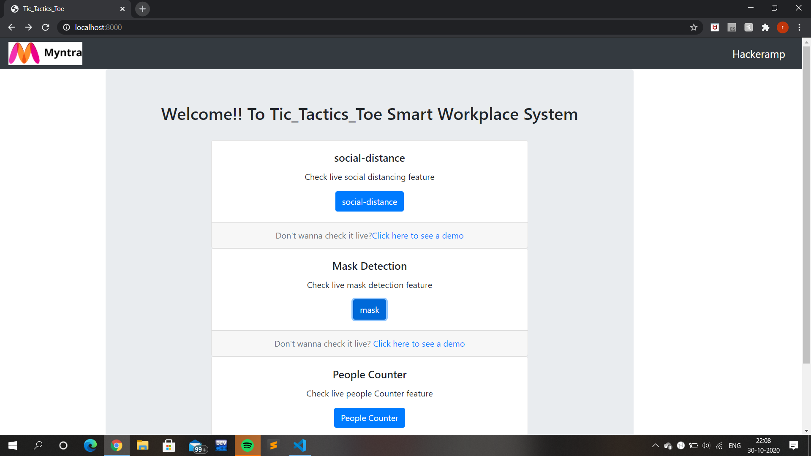

# Myntra HackerRamp
## :bulb: Problem Statement
```
An effective way to implement social distancing for On-Site Service employees working at places like warehouses, malls etc
where the employees cannot be shifted to work from home.
```
## :warning: TechStack/framework used
* Python
* OpenCV
* Keras
* Tensorflow
* Yolov3
* Flask

## **STEPS IN OUR PROJECT**
## :key: Prerequisites

All the dependencies and required libraries are included in the file <code>requirements.txt</code> [See here]()

## 🚀&nbsp; Installation
1. Clone the repo
```
$ git clone https://github.com/kaurramanpreet/Myntra_Comp.git
```

2. Change your directory to the cloned repo and create a Python virtual environment named 'test'
```
$ mkvirtualenv test
```

3. Now, run the following command in your Terminal/Command Prompt to install the libraries required
```
$ pip3 install -r requirements.txt   (if python 3 is installed)
$ pip install -r requirements.txt   (if python 2 is installed)
```
## :bulb: Working

1. Open terminal. Go into the cloned project directory and type the following command:
```
$ python app.py
```
2. Open browser. Type localhost:5000 in address bar and press enter 

## :key: Results



:file_folder: *PARTS(FOLDERS) OF THIS REPOSITORY*
---
* **app.py** is the root of the web application. This python script will link all the features of web-app.
* Code for hosting the full project as a web application is implemented in **WebServer** folder.
* Code for counting the number of people entered and exited the area has been added in **ENTRY_EXIT COUNT** folder.
* Code for detecting nose and mask i.e. mask has been worn, not worn and not properly worn has been added in **MASK AND NOSE DETECTION.**
* Code for measuring the distance between 2 people is implemented which keeps a check on the social distancing rules and had been added in **distance** folder.
* **requirements.txt** contains every installed dependency of our porject.
---

## :star: *app.py*
* This is the root of our web application.This is where all the Flask application goodness will go.It contains routes of all the features along with the functionality to run them.

---
## :star: *WebServer folder*

* currently the work includes to run all the features of our project from a web application.
* static folder contains all the output gifs and images .
* templates folder contains all the html pages that are being loaded on the web application.
---

## :star: *ENTRY_EXIT COUNT folder*

* counter.py :- The file that contains the implementation logic of people counter
* people_capture.mp4 :- The input video file used to test the code 
```  
for checking this code just run the counter.py file and you would be able to see the count of number of people entered in a store(room) and the count of people exited from the store(room) 
```
## :hourglass: **Project Demo**


---
## :star: *MASK AND NOSE DETECTION*
* Initially the work includes to check whether the person is wearing the mask or not
> * So we have tried to include the other part as well in which even if the person is wearing the mask , our code will check whether the mask is worn properly or not by detecting the nose(nostrils) or if the person is using hands instead of mask.
* code_mask.py :-The file that contains the implementation logic of Mask Detection.
* haarcascade_frontalface_alt2.xml :- Pre-trained haarcascade model to detect face.
* haarcascade_mcs_nose.xml :- Pre-trained haarcascade model to detect nose.
* mask_v1.mp4 :- The input file used to check the code for the validity in the above 3 cases.
* mask_v2.mp4 :- The input file used to check the code by using hands instead of mask.
* model.h5 :- Pre-trained MobileNet-V2 model based on ImageNet Database
* Dataset Link:- [DATASET](https://drive.google.com/drive/folders/1XDte2DL2Mf_hw4NsmGst7QtYoU7sMBVG?usp=sharing)
``` 
for checking the code just go to this folder and run the code_mask.py file and the results would be shown as
```
## :hourglass: **Project Demo**


---
## :star: *distance folder*
* it is used to find the distance between 2 persons and generated an red alarm when the people are not following the social distancing rule 
* SocialDistancingDetector.py :- The file that contains the implementation logic of checking the social distance between people.
* vtest.avi :- The input file used to check the code.
* yolo
  * coco.names :- 80 names of objects (labels) that can be detected on the image.
  * yolov3.cfg :- Configuration file with complete information about number of nodes in layers .
  * yolov3.weights:- values of neurons i.e weights already trained are stored in this file.
    * Link to weights file :- [WEIGHTS](https://drive.google.com/drive/folders/1CSY9WrDhRpyUIhncNXftyaaHo7u1NNXM?usp=sharing)
 
``` 
for checking the code just go to this folder and run the SocialDistancingDetector.py file and the results would be shown as 
```
## :hourglass: **Project Demo**


